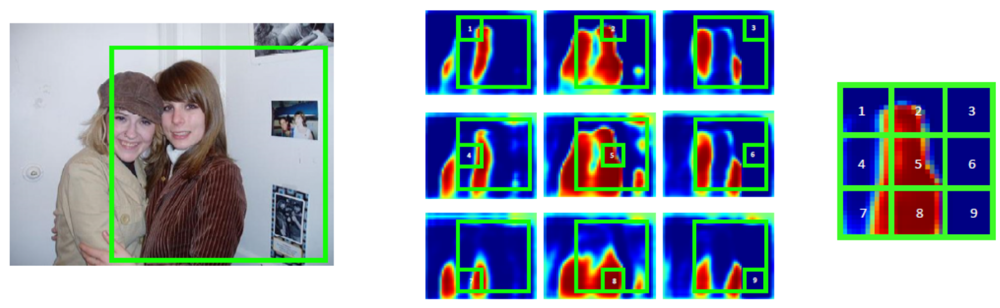
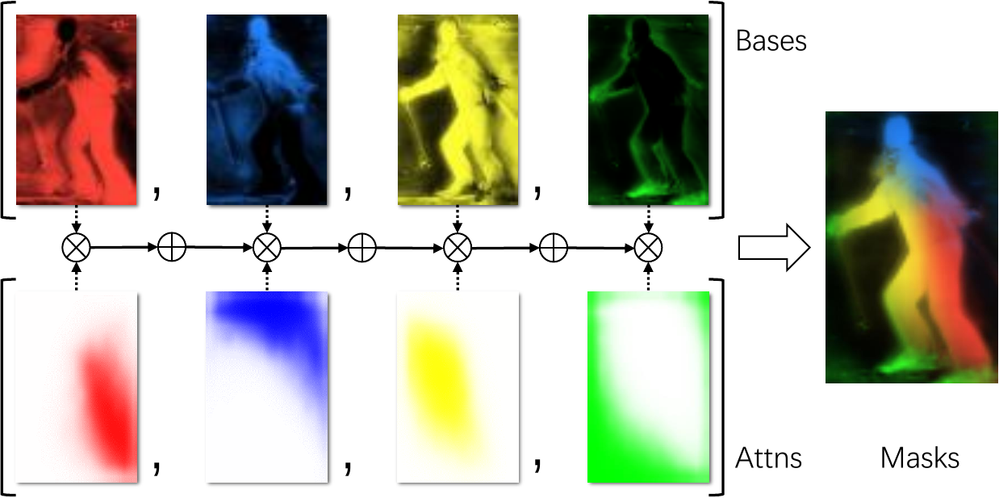
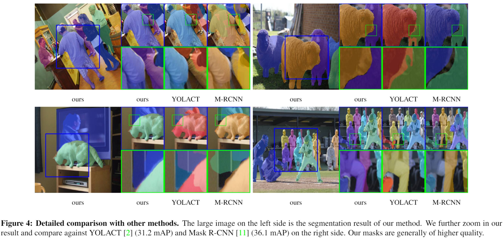
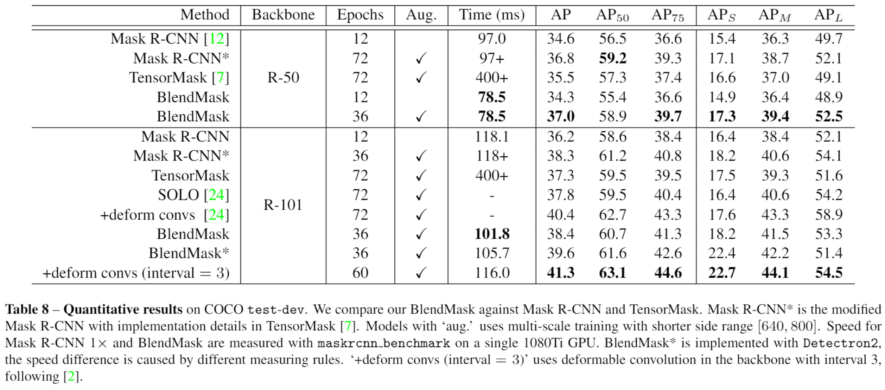

I want to briefly highlight our recent paper on instance segmentation:

* Hao Chen, Kunyang Sun, Zhi Tian, Chunhua Shen, Yongming Huang, Youliang Yan (2020) [BlendMask: Top-Down Meets Bottom-Up for Instance Segmentation](https://arxiv.org/abs/2001.00309)

The motivation behind this paper is to proposal a general framework for instance-level tasks to reduce the per-instance computation in two-stage methods which could slows down the inference in complex senarios.

## Background

Instance-level tasks such as instance segmentation, keypoint detection, tracking etc. all shares a similar procedure, detect-then-segment. That is, first use an object detection network to generate instance proposals and then for each instance, use a sub-network to predict the instance-level results. The advantange of this method against naive dense prediction is that for instances of different sizes, the features for the second stage is aligned (see [this review by Oksuz et. al.](https://arxiv.org/abs/1909.00169)). Furthermore, in the second stage, only possible foreground features are computed in the second stage, which is more efficient and the sample imbalance problem is somehow mitigated (see [Lin et. al.](https://arxiv.org/abs/1708.02002)).

But the second-stage computation can be costly if we need highly detailed predictions (such as [DensePose](http://densepose.org/) and high resolution instance segmentation like [PointRend](https://arxiv.org/abs/1912.08193)).

In BlendMask, we simplify the instance segmentation head of Mask R-CNN from a four-layer ConvNet to a tensor-product operation (called Blend) by reusing a densely predicted global segmentation mask. The framework resembles [YOLACT](https://arxiv.org/abs/1904.02689) with a redesigned top module (called attention). We are able to achieve 10ms+ speedup while improving the mask AP for instance segmentation. One advantage of BlendMask is that *we can increase the instance output resolution almost for free*.

## Top-down Meets Bottom-up (Middle-Out?)
Without loss of generality, we build BlendMask upon [FCOS](https://arxiv.org/abs/1904.01355), a widely adopted one-stage object detection framework, which by the way has a very supportive and active [github repo](https://github.com/tianzhi0549/FCOS). For instance segmentation, we add two modules, namely bottom and top to FCOS. These two modules are lightweight and flexible, allowing BlendMask to be incorporated into most object detection models.

The nomenclature of BlendMask top and bottom modules is adopted from the top-down and bottom-up methodologies in instance detection. Top-down approaches rely on high-level features to predict the entire instance, for example predicting bounding box offsets with final prediction layers of one-stage object detectors ([YOLO](https://pjreddie.com/darknet/yolo/), FCOS etc.). Bottom-up approaches ensemble local predictions, grouping local pixels or keypoints into instances ([embedding based instance segmentation](https://arxiv.org/abs/1708.02551), [OpenPose](https://arxiv.org/abs/1812.08008) etc.)

The key trade-off here is the receptive field size. With large receptive field, top-down approaches excel in identifying instances but the fine-grained details are often lost. On the contrary, bottom-up approaches retains high-resolution local information but usually have trouble grouping. (Bottom-up instance segmentation methods typically fall behind two-stage ones, except the recent [SOLO](https://arxiv.org/abs/1912.04488).)

It is naturally for us to consider merging these two approaches. YOLACT does exactly that. It utilizes a vector of mixture coefficients as the top module to linearly combine along the channels of the bottom module, a group of prototypes. 

Can we go one step further? To separate overlapping instances, it is important for the local features to encode relative positions. YOLACT training procedure does not handle this part explicitly. And the top module is too simple that cannot provide enough instance level information.

We make the top module more expressive by encoding the instance pose information. The idea is remotely relative to [InstanceFCN](https://arxiv.org/abs/1603.08678) and [FCIS](https://arxiv.org/abs/1611.07709), which encode relative position information by spliting each instance into $K\times K$ tiles. The final segmentation is cropped from $K\times K$ feature maps and combined.

  

We make this process parametric by using self-attention instead of hard one-hot weights, and contiuous, using bilinear upsampling for the attention.

  

The blender module effectively reduces the channel size of YOLACT protonet, from 32 to 4, and produces better masks.

## Qualitative and Quantitative Results

Our model produces higher quality masks than Mask R-CNN, especially in the following cases:

* Large objects with complex shapes (Horse ears, human poses). Mask R-CNN fails to provide sharp borders.
* Objects in separated parts (tennis players occluded by nets, trains divided by poles). Mask R-CNN tends to include occlusions as false positive or segment targets into separate objects.
* Overlapping  objects  (riders,  crowds,  drivers). Mask R-CNN gets uncertain on the borders and leaves larger false negative regions. Sometimes, it assigns parts to the wrong objects, such as the last example in the first row.

  

Our model surpasses Mask R-CNN in AP while being more efficient. Furthermore, it is very natural to generalize our model to other instance-level tasks such as panoptic segmentation and tracking.

  

Similar to  Mask R-CNN, we use RoIPooler to locate instances and extract features. We reduce the running time by moving the computation of R-CNN heads before the RoI sampling to generate position-sensitive feature maps. Repeated mask representation and computation for overlapping proposals are avoided.

Another advantage of BlendMask is that it can produce higher quality masks, since our output resolution is not restricted by the top-level sampling. Increasing the RoIPooler resolution of Mask R-CNN will introduce the following problem. The head computation increases quadratically with respect to the RoI size. Larger RoIs requires deeper head structures. Different from dense pixel predictions, RoI foreground predictor has to be aware  of  whole  instance-level information to distinguish foreground from other over-lapping instances. Thus, the larger the feature sizes are, the deeper sub-networks is needed.

For more results, please see our paper.